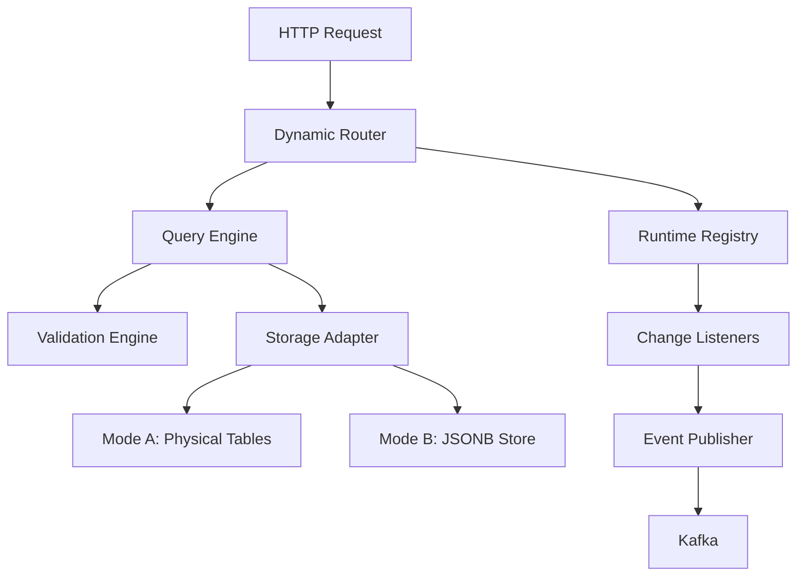

# Design Document: Platform Core Runtime

## Overview

The Platform Core Runtime is the foundational library for the EMF (Enterprise Microservice Framework) that enables dynamic, runtime-configurable collections. This design provides a comprehensive architecture for managing collection definitions, routing HTTP requests, executing queries, validating data, and persisting to storage backends.

### Key Design Principles

1. **Runtime Configurability**: Collections can be created, modified, and deleted at runtime without service restart
2. **Thread Safety**: All components support concurrent access with appropriate synchronization
3. **Extensibility**: Storage adapters and event hooks are pluggable via well-defined interfaces
4. **Performance**: Copy-on-write semantics for registry updates, connection pooling for database access
5. **Type Safety**: Strong typing throughout with Java records and sealed interfaces where appropriate

### Technology Stack

- **Language**: Java 21+ (leveraging records, sealed interfaces, pattern matching)
- **Framework**: Spring Boot 3.x (Web, Security, Actuator)
- **Database**: PostgreSQL 15+ with JDBC/JPA
- **Messaging**: Spring Kafka for event publishing
- **Caching**: Spring Data Redis for distributed caching
- **Build**: Maven with multi-module structure

## Architecture

### High-Level Component Diagram




### Component Interaction Flow

1. **Request Arrival**: HTTP request arrives at Dynamic Router
2. **Collection Lookup**: Router queries Runtime Registry for collection definition
3. **Query Building**: Query Engine parses request parameters (pagination, sorting, filtering, fields)
4. **Validation**: Validation Engine validates input data against collection definition
5. **Storage Operation**: Storage Adapter executes the operation (CRUD or query)
6. **Event Publishing**: Event hooks are invoked for lifecycle events
7. **Response**: Formatted response returned to client

### Module Structure

```
emf-platform/
├── runtime-core/
│   ├── model/              # Collection and field definitions
│   ├── registry/           # Runtime registry implementation
│   ├── router/             # Dynamic HTTP routing
│   ├── query/              # Query engine and builder
│   ├── validation/         # Validation engine
│   ├── storage/            # Storage adapter interface and implementations
│   ├── events/             # Event publishing hooks
│   └── config/             # Spring configuration
```

## Components and Interfaces

### 1. Collection Definition Model

The collection definition model uses Java records for immutability and clarity.

#### CollectionDefinition

```java
public record CollectionDefinition(
    String name,
    String displayName,
    String description,
    List<FieldDefinition> fields,
    StorageConfig storageConfig,
    ApiConfig apiConfig,
    AuthzConfig authzConfig,
    EventsConfig eventsConfig,
    long version,
    Instant createdAt,
    Instant updatedAt
) {
    public CollectionDefinition {
        Objects.requireNonNull(name, "name cannot be null");
        Objects.requireNonNull(fields, "fields cannot be null");
        fields = List.copyOf(fields); // Defensive copy
    }
    
    public FieldDefinition getField(String fieldName) {
        return fields.stream()
            .filter(f -> f.name().equals(fieldName))
            .findFirst()
            .orElse(null);
    }
}
```

#### FieldDefinition

```java
public record FieldDefinition(
    String name,
    FieldType type,
    boolean nullable,
    boolean immutable,
    boolean unique,
    Object defaultValue,
    ValidationRules validationRules,
    List<String> enumValues,
    ReferenceConfig referenceConfig
) {
    public FieldDefinition {
        Objects.requireNonNull(name, "name cannot be null");
        Objects.requireNonNull(type, "type cannot be null");
    }
}
```

#### FieldType Enum

```java
public enum FieldType {
    STRING,
    INTEGER,
    LONG,
    DOUBLE,
    BOOLEAN,
    DATE,
    DATETIME,
    JSON
}
```

#### ValidationRules

```java
public record ValidationRules(
    Integer minValue,
    Integer maxValue,
    Integer minLength,
    Integer maxLength,
    String pattern
) {}
```

#### Configuration Records

```java
public record StorageConfig(
    StorageMode mode,
    String tableName,
    Map<String, String> adapterConfig
) {}

public enum StorageMode {
    PHYSICAL_TABLES,  // Mode A
    JSONB_STORE       // Mode B
}

public record ApiConfig(
    boolean listEnabled,
    boolean getEnabled,
    boolean createEnabled,
    boolean updateEnabled,
    boolean deleteEnabled,
    String basePath
) {}

public record AuthzConfig(
    boolean enabled,
    List<String> readRoles,
    List<String> writeRoles
) {}

public record EventsConfig(
    boolean enabled,
    String topicPrefix,
    List<String> eventTypes
) {}

public record ReferenceConfig(
    String targetCollection,
    String targetField,
    boolean cascadeDelete
) {}
```

### 2. Runtime Registry

The Runtime Registry uses copy-on-write semantics for thread-safe updates.

#### CollectionRegistry Interface

```java
public interface CollectionRegistry {
    
    /**
     * Register or update a collection definition.
     * Uses copy-on-write semantics for thread safety.
     */
    void register(CollectionDefinition definition);
    
    /**
     * Get a collection definition by name.
     * Returns null if not found.
     */
    CollectionDefinition get(String collectionName);
    
    /**
     * Get all registered collection names.
     */
    Set<String> getAllCollectionNames();
    
    /**
     * Remove a collection definition.
     */
    void unregister(String collectionName);
    
    /**
     * Add a listener for collection changes.
     */
    void addListener(CollectionChangeListener listener);
    
    /**
     * Remove a listener.
     */
    void removeListener(CollectionChangeListener listener);
}
```

#### CollectionChangeListener Interface

```java
public interface CollectionChangeListener {
    void onCollectionRegistered(CollectionDefinition definition);
    void onCollectionUpdated(CollectionDefinition oldDefinition, CollectionDefinition newDefinition);
    void onCollectionUnregistered(String collectionName);
}
```

#### ConcurrentCollectionRegistry Implementation

```java
public class ConcurrentCollectionRegistry implements CollectionRegistry {
    
    // Volatile reference to immutable map for copy-on-write
    private volatile Map<String, CollectionDefinition> collections = Map.of();
    
    // Lock for write operations only
    private final ReentrantReadWriteLock lock = new ReentrantReadWriteLock();
    
    // Thread-safe listener list
    private final CopyOnWriteArrayList<CollectionChangeListener> listeners = new CopyOnWriteArrayList<>();
    
    @Override
    public void register(CollectionDefinition definition) {
        lock.writeLock().lock();
        try {
            Map<String, CollectionDefinition> newMap = new HashMap<>(collections);
            CollectionDefinition old = newMap.put(definition.name(), definition);
            collections = Map.copyOf(newMap); // Immutable snapshot
            
            // Notify listeners outside lock
            if (old == null) {
                notifyRegistered(definition);
            } else {
                notifyUpdated(old, definition);
            }
        } finally {
            lock.writeLock().unlock();
        }
    }
    
    @Override
    public CollectionDefinition get(String collectionName) {
        // No lock needed - reading volatile reference to immutable map
        return collections.get(collectionName);
    }
    
    // Additional methods...
}
```


### 3. Dynamic Router

The Dynamic Router maps HTTP requests to collection operations.

#### DynamicCollectionRouter

```java
@RestController
@RequestMapping("/api/collections")
public class DynamicCollectionRouter {
    
    private final CollectionRegistry registry;
    private final QueryEngine queryEngine;
    private final ValidationEngine validationEngine;
    
    @GetMapping("/{collectionName}")
    public ResponseEntity<QueryResult> list(
            @PathVariable String collectionName,
            @RequestParam Map<String, String> params) {
        
        CollectionDefinition definition = registry.get(collectionName);
        if (definition == null) {
            return ResponseEntity.notFound().build();
        }
        
        QueryRequest queryRequest = QueryRequest.fromParams(params);
        QueryResult result = queryEngine.executeQuery(definition, queryRequest);
        
        return ResponseEntity.ok(result);
    }
    
    @GetMapping("/{collectionName}/{id}")
    public ResponseEntity<Map<String, Object>> get(
            @PathVariable String collectionName,
            @PathVariable String id) {
        
        CollectionDefinition definition = registry.get(collectionName);
        if (definition == null) {
            return ResponseEntity.notFound().build();
        }
        
        Optional<Map<String, Object>> record = queryEngine.getById(definition, id);
        return record.map(ResponseEntity::ok)
                     .orElse(ResponseEntity.notFound().build());
    }
    
    @PostMapping("/{collectionName}")
    public ResponseEntity<Map<String, Object>> create(
            @PathVariable String collectionName,
            @RequestBody Map<String, Object> data) {
        
        CollectionDefinition definition = registry.get(collectionName);
        if (definition == null) {
            return ResponseEntity.notFound().build();
        }
        
        ValidationResult validation = validationEngine.validate(definition, data, OperationType.CREATE);
        if (!validation.isValid()) {
            return ResponseEntity.badRequest().body(validation.toErrorResponse());
        }
        
        Map<String, Object> created = queryEngine.create(definition, data);
        return ResponseEntity.status(HttpStatus.CREATED).body(created);
    }
    
    @PutMapping("/{collectionName}/{id}")
    public ResponseEntity<Map<String, Object>> update(
            @PathVariable String collectionName,
            @PathVariable String id,
            @RequestBody Map<String, Object> data) {
        
        CollectionDefinition definition = registry.get(collectionName);
        if (definition == null) {
            return ResponseEntity.notFound().build();
        }
        
        ValidationResult validation = validationEngine.validate(definition, data, OperationType.UPDATE);
        if (!validation.isValid()) {
            return ResponseEntity.badRequest().body(validation.toErrorResponse());
        }
        
        Optional<Map<String, Object>> updated = queryEngine.update(definition, id, data);
        return updated.map(ResponseEntity::ok)
                      .orElse(ResponseEntity.notFound().build());
    }
    
    @DeleteMapping("/{collectionName}/{id}")
    public ResponseEntity<Void> delete(
            @PathVariable String collectionName,
            @PathVariable String id) {
        
        CollectionDefinition definition = registry.get(collectionName);
        if (definition == null) {
            return ResponseEntity.notFound().build();
        }
        
        boolean deleted = queryEngine.delete(definition, id);
        return deleted ? ResponseEntity.noContent().build() 
                       : ResponseEntity.notFound().build();
    }
}
```

### 4. Query Engine

The Query Engine builds and executes queries with support for pagination, sorting, filtering, and field selection.

#### QueryRequest

```java
public record QueryRequest(
    Pagination pagination,
    List<SortField> sorting,
    List<String> fields,
    List<FilterCondition> filters
) {
    public static QueryRequest fromParams(Map<String, String> params) {
        // Parse pagination: page[number], page[size]
        Pagination pagination = parsePagination(params);
        
        // Parse sorting: sort=field1,-field2
        List<SortField> sorting = parseSorting(params.get("sort"));
        
        // Parse fields: fields=fieldA,fieldB
        List<String> fields = parseFields(params.get("fields"));
        
        // Parse filters: filter[field][op]=value
        List<FilterCondition> filters = parseFilters(params);
        
        return new QueryRequest(pagination, sorting, fields, filters);
    }
}
```

#### Pagination

```java
public record Pagination(
    int pageNumber,
    int pageSize
) {
    public static final int DEFAULT_PAGE_SIZE = 20;
    
    public Pagination {
        if (pageNumber < 1) {
            throw new IllegalArgumentException("Page number must be >= 1");
        }
        if (pageSize < 1 || pageSize > 1000) {
            throw new IllegalArgumentException("Page size must be between 1 and 1000");
        }
    }
    
    public int offset() {
        return (pageNumber - 1) * pageSize;
    }
}
```

#### SortField

```java
public record SortField(
    String fieldName,
    SortDirection direction
) {}

public enum SortDirection {
    ASC, DESC
}
```

#### FilterCondition

```java
public record FilterCondition(
    String fieldName,
    FilterOperator operator,
    Object value
) {}

public enum FilterOperator {
    EQ,        // equals
    NEQ,       // not equals
    GT,        // greater than
    LT,        // less than
    GTE,       // greater than or equal
    LTE,       // less than or equal
    ISNULL,    // is null
    CONTAINS,  // contains (case-sensitive)
    STARTS,    // starts with (case-sensitive)
    ENDS,      // ends with (case-sensitive)
    ICONTAINS, // contains (case-insensitive)
    ISTARTS,   // starts with (case-insensitive)
    IENDS,     // ends with (case-insensitive)
    IEQ        // equals (case-insensitive)
}
```

#### QueryResult

```java
public record QueryResult(
    List<Map<String, Object>> data,
    PaginationMetadata metadata
) {}

public record PaginationMetadata(
    long totalCount,
    int currentPage,
    int pageSize,
    int totalPages
) {}
```

#### QueryEngine Interface

```java
public interface QueryEngine {
    
    /**
     * Execute a query against a collection.
     */
    QueryResult executeQuery(CollectionDefinition definition, QueryRequest request);
    
    /**
     * Get a single record by ID.
     */
    Optional<Map<String, Object>> getById(CollectionDefinition definition, String id);
    
    /**
     * Create a new record.
     */
    Map<String, Object> create(CollectionDefinition definition, Map<String, Object> data);
    
    /**
     * Update an existing record.
     */
    Optional<Map<String, Object>> update(CollectionDefinition definition, String id, Map<String, Object> data);
    
    /**
     * Delete a record.
     */
    boolean delete(CollectionDefinition definition, String id);
}
```


#### DefaultQueryEngine Implementation

```java
@Service
public class DefaultQueryEngine implements QueryEngine {
    
    private final StorageAdapter storageAdapter;
    private final EventPublisher eventPublisher;
    
    @Override
    public QueryResult executeQuery(CollectionDefinition definition, QueryRequest request) {
        // Validate sort fields exist
        validateSortFields(definition, request.sorting());
        
        // Validate filter fields exist
        validateFilterFields(definition, request.filters());
        
        // Validate requested fields exist
        validateRequestedFields(definition, request.fields());
        
        // Execute query via storage adapter
        QueryResult result = storageAdapter.query(definition, request);
        
        // Log query performance
        logQueryMetrics(definition, request, result);
        
        return result;
    }
    
    @Override
    public Map<String, Object> create(CollectionDefinition definition, Map<String, Object> data) {
        // Add system fields
        data.put("id", UUID.randomUUID().toString());
        data.put("createdAt", Instant.now());
        data.put("updatedAt", Instant.now());
        
        // Persist via storage adapter
        Map<String, Object> created = storageAdapter.create(definition, data);
        
        // Publish event
        eventPublisher.publishCreate(definition, created);
        
        return created;
    }
    
    @Override
    public Optional<Map<String, Object>> update(CollectionDefinition definition, String id, Map<String, Object> data) {
        // Update timestamp
        data.put("updatedAt", Instant.now());
        
        // Persist via storage adapter
        Optional<Map<String, Object>> updated = storageAdapter.update(definition, id, data);
        
        // Publish event if successful
        updated.ifPresent(record -> eventPublisher.publishUpdate(definition, record));
        
        return updated;
    }
    
    @Override
    public boolean delete(CollectionDefinition definition, String id) {
        boolean deleted = storageAdapter.delete(definition, id);
        
        if (deleted) {
            eventPublisher.publishDelete(definition, id);
        }
        
        return deleted;
    }
}
```

### 5. Storage Adapter Interface

The Storage Adapter provides an extensible abstraction for different storage backends.

#### StorageAdapter Interface

```java
public interface StorageAdapter {
    
    /**
     * Initialize storage for a collection (e.g., create table in Mode A).
     */
    void initializeCollection(CollectionDefinition definition);
    
    /**
     * Update storage schema when collection definition changes.
     */
    void updateCollectionSchema(CollectionDefinition oldDefinition, CollectionDefinition newDefinition);
    
    /**
     * Query records from a collection.
     */
    QueryResult query(CollectionDefinition definition, QueryRequest request);
    
    /**
     * Get a single record by ID.
     */
    Optional<Map<String, Object>> getById(CollectionDefinition definition, String id);
    
    /**
     * Create a new record.
     */
    Map<String, Object> create(CollectionDefinition definition, Map<String, Object> data);
    
    /**
     * Update an existing record.
     */
    Optional<Map<String, Object>> update(CollectionDefinition definition, String id, Map<String, Object> data);
    
    /**
     * Delete a record.
     */
    boolean delete(CollectionDefinition definition, String id);
    
    /**
     * Check if a value is unique for a field.
     */
    boolean isUnique(CollectionDefinition definition, String fieldName, Object value, String excludeId);
}
```

#### PhysicalTableStorageAdapter (Mode A)

```java
@Service
@ConditionalOnProperty(name = "emf.storage.mode", havingValue = "PHYSICAL_TABLES", matchIfMissing = true)
public class PhysicalTableStorageAdapter implements StorageAdapter {
    
    private final JdbcTemplate jdbcTemplate;
    private final SchemaMigrationEngine migrationEngine;
    
    @Override
    public void initializeCollection(CollectionDefinition definition) {
        String tableName = definition.storageConfig().tableName();
        
        // Build CREATE TABLE statement
        StringBuilder sql = new StringBuilder("CREATE TABLE IF NOT EXISTS ");
        sql.append(tableName).append(" (");
        sql.append("id VARCHAR(36) PRIMARY KEY, ");
        sql.append("created_at TIMESTAMP NOT NULL, ");
        sql.append("updated_at TIMESTAMP NOT NULL");
        
        for (FieldDefinition field : definition.fields()) {
            sql.append(", ");
            sql.append(field.name()).append(" ");
            sql.append(mapFieldTypeToSql(field.type()));
            
            if (!field.nullable()) {
                sql.append(" NOT NULL");
            }
            
            if (field.unique()) {
                sql.append(" UNIQUE");
            }
        }
        
        sql.append(")");
        
        jdbcTemplate.execute(sql.toString());
        
        // Record migration
        migrationEngine.recordMigration(definition.name(), "CREATE_TABLE", sql.toString());
    }
    
    @Override
    public QueryResult query(CollectionDefinition definition, QueryRequest request) {
        String tableName = definition.storageConfig().tableName();
        
        // Build SELECT query
        StringBuilder sql = new StringBuilder("SELECT ");
        
        // Field selection
        if (request.fields().isEmpty()) {
            sql.append("*");
        } else {
            sql.append("id, "); // Always include ID
            sql.append(String.join(", ", request.fields()));
        }
        
        sql.append(" FROM ").append(tableName);
        
        // WHERE clause for filters
        List<Object> params = new ArrayList<>();
        if (!request.filters().isEmpty()) {
            sql.append(" WHERE ");
            sql.append(buildWhereClause(request.filters(), params));
        }
        
        // ORDER BY clause
        if (!request.sorting().isEmpty()) {
            sql.append(" ORDER BY ");
            sql.append(buildOrderByClause(request.sorting()));
        }
        
        // LIMIT and OFFSET for pagination
        Pagination pagination = request.pagination();
        sql.append(" LIMIT ? OFFSET ?");
        params.add(pagination.pageSize());
        params.add(pagination.offset());
        
        // Execute query
        List<Map<String, Object>> data = jdbcTemplate.queryForList(sql.toString(), params.toArray());
        
        // Get total count
        long totalCount = getTotalCount(tableName, request.filters());
        
        // Build metadata
        PaginationMetadata metadata = new PaginationMetadata(
            totalCount,
            pagination.pageNumber(),
            pagination.pageSize(),
            (int) Math.ceil((double) totalCount / pagination.pageSize())
        );
        
        return new QueryResult(data, metadata);
    }
    
    private String mapFieldTypeToSql(FieldType type) {
        return switch (type) {
            case STRING -> "TEXT";
            case INTEGER -> "INTEGER";
            case LONG -> "BIGINT";
            case DOUBLE -> "DOUBLE PRECISION";
            case BOOLEAN -> "BOOLEAN";
            case DATE -> "DATE";
            case DATETIME -> "TIMESTAMP";
            case JSON -> "JSONB";
        };
    }
    
    private String buildWhereClause(List<FilterCondition> filters, List<Object> params) {
        return filters.stream()
            .map(filter -> buildFilterCondition(filter, params))
            .collect(Collectors.joining(" AND "));
    }
    
    private String buildFilterCondition(FilterCondition filter, List<Object> params) {
        String fieldName = filter.fieldName();
        
        return switch (filter.operator()) {
            case EQ -> {
                params.add(filter.value());
                yield fieldName + " = ?";
            }
            case NEQ -> {
                params.add(filter.value());
                yield fieldName + " != ?";
            }
            case GT -> {
                params.add(filter.value());
                yield fieldName + " > ?";
            }
            case LT -> {
                params.add(filter.value());
                yield fieldName + " < ?";
            }
            case GTE -> {
                params.add(filter.value());
                yield fieldName + " >= ?";
            }
            case LTE -> {
                params.add(filter.value());
                yield fieldName + " <= ?";
            }
            case ISNULL -> fieldName + " IS NULL";
            case CONTAINS -> {
                params.add("%" + filter.value() + "%");
                yield fieldName + " LIKE ?";
            }
            case STARTS -> {
                params.add(filter.value() + "%");
                yield fieldName + " LIKE ?";
            }
            case ENDS -> {
                params.add("%" + filter.value());
                yield fieldName + " LIKE ?";
            }
            case ICONTAINS -> {
                params.add("%" + filter.value() + "%");
                yield "LOWER(" + fieldName + ") LIKE LOWER(?)";
            }
            case ISTARTS -> {
                params.add(filter.value() + "%");
                yield "LOWER(" + fieldName + ") LIKE LOWER(?)";
            }
            case IENDS -> {
                params.add("%" + filter.value());
                yield "LOWER(" + fieldName + ") LIKE LOWER(?)";
            }
            case IEQ -> {
                params.add(filter.value());
                yield "LOWER(" + fieldName + ") = LOWER(?)";
            }
        };
    }
    
    private String buildOrderByClause(List<SortField> sorting) {
        return sorting.stream()
            .map(sort -> sort.fieldName() + " " + sort.direction())
            .collect(Collectors.joining(", "));
    }
}
```


#### JsonbStorageAdapter (Mode B)

```java
@Service
@ConditionalOnProperty(name = "emf.storage.mode", havingValue = "JSONB_STORE")
public class JsonbStorageAdapter implements StorageAdapter {
    
    private final JdbcTemplate jdbcTemplate;
    
    // Single table for all collections
    private static final String TABLE_NAME = "emf_collections";
    
    @Override
    public void initializeCollection(CollectionDefinition definition) {
        // Ensure the shared table exists
        String sql = """
            CREATE TABLE IF NOT EXISTS emf_collections (
                id VARCHAR(36) PRIMARY KEY,
                collection_name VARCHAR(255) NOT NULL,
                data JSONB NOT NULL,
                created_at TIMESTAMP NOT NULL,
                updated_at TIMESTAMP NOT NULL,
                INDEX idx_collection_name (collection_name)
            )
            """;
        
        jdbcTemplate.execute(sql);
    }
    
    @Override
    public QueryResult query(CollectionDefinition definition, QueryRequest request) {
        StringBuilder sql = new StringBuilder("SELECT id, data, created_at, updated_at FROM ");
        sql.append(TABLE_NAME);
        sql.append(" WHERE collection_name = ?");
        
        List<Object> params = new ArrayList<>();
        params.add(definition.name());
        
        // Add JSONB filters
        for (FilterCondition filter : request.filters()) {
            sql.append(" AND ");
            sql.append(buildJsonbFilterCondition(filter, params));
        }
        
        // Sorting
        if (!request.sorting().isEmpty()) {
            sql.append(" ORDER BY ");
            sql.append(buildJsonbOrderByClause(request.sorting()));
        }
        
        // Pagination
        Pagination pagination = request.pagination();
        sql.append(" LIMIT ? OFFSET ?");
        params.add(pagination.pageSize());
        params.add(pagination.offset());
        
        // Execute query
        List<Map<String, Object>> data = jdbcTemplate.query(
            sql.toString(),
            params.toArray(),
            (rs, rowNum) -> {
                Map<String, Object> record = new HashMap<>();
                record.put("id", rs.getString("id"));
                
                // Parse JSONB data
                String jsonData = rs.getString("data");
                Map<String, Object> dataMap = parseJson(jsonData);
                record.putAll(dataMap);
                
                // Apply field selection
                if (!request.fields().isEmpty()) {
                    record.keySet().retainAll(request.fields());
                    record.put("id", rs.getString("id")); // Always keep ID
                }
                
                return record;
            }
        );
        
        // Get total count
        long totalCount = getTotalCount(definition.name(), request.filters());
        
        PaginationMetadata metadata = new PaginationMetadata(
            totalCount,
            pagination.pageNumber(),
            pagination.pageSize(),
            (int) Math.ceil((double) totalCount / pagination.pageSize())
        );
        
        return new QueryResult(data, metadata);
    }
    
    private String buildJsonbFilterCondition(FilterCondition filter, List<Object> params) {
        String jsonPath = "data->>" + filter.fieldName();
        
        return switch (filter.operator()) {
            case EQ -> {
                params.add(filter.value().toString());
                yield jsonPath + " = ?";
            }
            case CONTAINS -> {
                params.add("%" + filter.value() + "%");
                yield jsonPath + " LIKE ?";
            }
            // Additional operators...
            default -> throw new UnsupportedOperationException("Operator not supported: " + filter.operator());
        };
    }
}
```

#### SchemaMigrationEngine

```java
@Service
public class SchemaMigrationEngine {
    
    private final JdbcTemplate jdbcTemplate;
    
    public void recordMigration(String collectionName, String migrationType, String sql) {
        String insertSql = """
            INSERT INTO emf_migrations (collection_name, migration_type, sql_statement, executed_at)
            VALUES (?, ?, ?, ?)
            """;
        
        jdbcTemplate.update(insertSql, collectionName, migrationType, sql, Instant.now());
    }
    
    public void migrateSchema(CollectionDefinition oldDefinition, CollectionDefinition newDefinition) {
        List<String> migrations = new ArrayList<>();
        
        // Detect added fields
        for (FieldDefinition newField : newDefinition.fields()) {
            if (oldDefinition.getField(newField.name()) == null) {
                migrations.add(generateAddColumnSql(newDefinition, newField));
            }
        }
        
        // Detect removed fields (mark as deprecated, don't drop)
        for (FieldDefinition oldField : oldDefinition.fields()) {
            if (newDefinition.getField(oldField.name()) == null) {
                migrations.add(generateDeprecateColumnSql(newDefinition, oldField));
            }
        }
        
        // Detect type changes
        for (FieldDefinition newField : newDefinition.fields()) {
            FieldDefinition oldField = oldDefinition.getField(newField.name());
            if (oldField != null && !oldField.type().equals(newField.type())) {
                validateTypeChange(oldField, newField);
                migrations.add(generateAlterColumnTypeSql(newDefinition, newField));
            }
        }
        
        // Execute migrations
        for (String migration : migrations) {
            jdbcTemplate.execute(migration);
            recordMigration(newDefinition.name(), "ALTER_TABLE", migration);
        }
    }
    
    private String generateAddColumnSql(CollectionDefinition definition, FieldDefinition field) {
        return String.format(
            "ALTER TABLE %s ADD COLUMN %s %s%s",
            definition.storageConfig().tableName(),
            field.name(),
            mapFieldTypeToSql(field.type()),
            field.nullable() ? "" : " NOT NULL"
        );
    }
}
```

### 6. Validation Engine

The Validation Engine enforces field-level constraints.

#### ValidationEngine Interface

```java
public interface ValidationEngine {
    ValidationResult validate(CollectionDefinition definition, Map<String, Object> data, OperationType operationType);
}

public enum OperationType {
    CREATE, UPDATE
}
```

#### ValidationResult

```java
public record ValidationResult(
    boolean valid,
    List<FieldError> errors
) {
    public static ValidationResult success() {
        return new ValidationResult(true, List.of());
    }
    
    public static ValidationResult failure(List<FieldError> errors) {
        return new ValidationResult(false, errors);
    }
    
    public Map<String, Object> toErrorResponse() {
        Map<String, Object> response = new HashMap<>();
        response.put("valid", valid);
        response.put("errors", errors.stream()
            .collect(Collectors.groupingBy(
                FieldError::fieldName,
                Collectors.mapping(FieldError::message, Collectors.toList())
            )));
        return response;
    }
}

public record FieldError(
    String fieldName,
    String message,
    String constraint
) {}
```

#### DefaultValidationEngine Implementation

```java
@Service
public class DefaultValidationEngine implements ValidationEngine {
    
    private final StorageAdapter storageAdapter;
    
    @Override
    public ValidationResult validate(CollectionDefinition definition, Map<String, Object> data, OperationType operationType) {
        List<FieldError> errors = new ArrayList<>();
        
        for (FieldDefinition field : definition.fields()) {
            Object value = data.get(field.name());
            
            // Nullable check
            if (value == null) {
                if (!field.nullable()) {
                    errors.add(new FieldError(field.name(), "Field is required", "nullable"));
                }
                continue; // Skip other validations if null
            }
            
            // Immutable check (only for updates)
            if (operationType == OperationType.UPDATE && field.immutable()) {
                errors.add(new FieldError(field.name(), "Field is immutable and cannot be updated", "immutable"));
            }
            
            // Type validation
            if (!isValidType(value, field.type())) {
                errors.add(new FieldError(field.name(), "Invalid type for field", "type"));
                continue;
            }
            
            // Validation rules
            ValidationRules rules = field.validationRules();
            if (rules != null) {
                validateRules(field, value, rules, errors);
            }
            
            // Enum validation
            if (field.enumValues() != null && !field.enumValues().isEmpty()) {
                if (!field.enumValues().contains(value.toString())) {
                    errors.add(new FieldError(
                        field.name(),
                        "Value must be one of: " + String.join(", ", field.enumValues()),
                        "enum"
                    ));
                }
            }
            
            // Unique validation
            if (field.unique()) {
                String excludeId = (String) data.get("id");
                if (!storageAdapter.isUnique(definition, field.name(), value, excludeId)) {
                    errors.add(new FieldError(field.name(), "Value must be unique", "unique"));
                }
            }
            
            // Reference validation
            if (field.referenceConfig() != null) {
                validateReference(field, value, errors);
            }
        }
        
        return errors.isEmpty() ? ValidationResult.success() : ValidationResult.failure(errors);
    }
    
    private void validateRules(FieldDefinition field, Object value, ValidationRules rules, List<FieldError> errors) {
        // Min/Max value validation
        if (value instanceof Number num) {
            if (rules.minValue() != null && num.doubleValue() < rules.minValue()) {
                errors.add(new FieldError(field.name(), "Value must be >= " + rules.minValue(), "minValue"));
            }
            if (rules.maxValue() != null && num.doubleValue() > rules.maxValue()) {
                errors.add(new FieldError(field.name(), "Value must be <= " + rules.maxValue(), "maxValue"));
            }
        }
        
        // Length validation
        if (value instanceof String str) {
            if (rules.minLength() != null && str.length() < rules.minLength()) {
                errors.add(new FieldError(field.name(), "Length must be >= " + rules.minLength(), "minLength"));
            }
            if (rules.maxLength() != null && str.length() > rules.maxLength()) {
                errors.add(new FieldError(field.name(), "Length must be <= " + rules.maxLength(), "maxLength"));
            }
            
            // Pattern validation
            if (rules.pattern() != null && !str.matches(rules.pattern())) {
                errors.add(new FieldError(field.name(), "Value does not match required pattern", "pattern"));
            }
        }
    }
    
    private boolean isValidType(Object value, FieldType expectedType) {
        return switch (expectedType) {
            case STRING -> value instanceof String;
            case INTEGER -> value instanceof Integer;
            case LONG -> value instanceof Long;
            case DOUBLE -> value instanceof Double;
            case BOOLEAN -> value instanceof Boolean;
            case DATE, DATETIME -> value instanceof String; // ISO-8601 format
            case JSON -> value instanceof Map || value instanceof List;
        };
    }
}
```


### 7. Event Publishing Hooks

The Event Publisher provides integration points for Kafka event publishing.

#### EventPublisher Interface

```java
public interface EventPublisher {
    void publishCreate(CollectionDefinition definition, Map<String, Object> record);
    void publishUpdate(CollectionDefinition definition, Map<String, Object> record);
    void publishDelete(CollectionDefinition definition, String recordId);
}
```

#### CollectionEvent

```java
public record CollectionEvent(
    String eventId,
    String eventType,
    String collectionName,
    String recordId,
    Map<String, Object> recordData,
    Instant timestamp,
    Map<String, String> metadata
) {
    public static CollectionEvent create(CollectionDefinition definition, Map<String, Object> record) {
        return new CollectionEvent(
            UUID.randomUUID().toString(),
            "CREATED",
            definition.name(),
            (String) record.get("id"),
            record,
            Instant.now(),
            Map.of("version", String.valueOf(definition.version()))
        );
    }
    
    public static CollectionEvent update(CollectionDefinition definition, Map<String, Object> record) {
        return new CollectionEvent(
            UUID.randomUUID().toString(),
            "UPDATED",
            definition.name(),
            (String) record.get("id"),
            record,
            Instant.now(),
            Map.of("version", String.valueOf(definition.version()))
        );
    }
    
    public static CollectionEvent delete(CollectionDefinition definition, String recordId) {
        return new CollectionEvent(
            UUID.randomUUID().toString(),
            "DELETED",
            definition.name(),
            recordId,
            Map.of(),
            Instant.now(),
            Map.of("version", String.valueOf(definition.version()))
        );
    }
}
```

#### KafkaEventPublisher Implementation

```java
@Service
@ConditionalOnProperty(name = "emf.events.enabled", havingValue = "true")
public class KafkaEventPublisher implements EventPublisher {
    
    private final KafkaTemplate<String, CollectionEvent> kafkaTemplate;
    
    @Override
    public void publishCreate(CollectionDefinition definition, Map<String, Object> record) {
        if (!definition.eventsConfig().enabled()) {
            return;
        }
        
        CollectionEvent event = CollectionEvent.create(definition, record);
        String topic = buildTopicName(definition, "created");
        
        kafkaTemplate.send(topic, event.recordId(), event)
            .whenComplete((result, ex) -> {
                if (ex != null) {
                    log.error("Failed to publish create event for collection: {}", definition.name(), ex);
                } else {
                    log.debug("Published create event for collection: {}", definition.name());
                }
            });
    }
    
    @Override
    public void publishUpdate(CollectionDefinition definition, Map<String, Object> record) {
        if (!definition.eventsConfig().enabled()) {
            return;
        }
        
        CollectionEvent event = CollectionEvent.update(definition, record);
        String topic = buildTopicName(definition, "updated");
        
        kafkaTemplate.send(topic, event.recordId(), event)
            .whenComplete((result, ex) -> {
                if (ex != null) {
                    log.error("Failed to publish update event for collection: {}", definition.name(), ex);
                }
            });
    }
    
    @Override
    public void publishDelete(CollectionDefinition definition, String recordId) {
        if (!definition.eventsConfig().enabled()) {
            return;
        }
        
        CollectionEvent event = CollectionEvent.delete(definition, recordId);
        String topic = buildTopicName(definition, "deleted");
        
        kafkaTemplate.send(topic, recordId, event)
            .whenComplete((result, ex) -> {
                if (ex != null) {
                    log.error("Failed to publish delete event for collection: {}", definition.name(), ex);
                }
            });
    }
    
    private String buildTopicName(CollectionDefinition definition, String eventType) {
        String prefix = definition.eventsConfig().topicPrefix();
        return String.format("%s.%s.%s", prefix, definition.name(), eventType);
    }
}
```

### 8. Configuration Model Builders

Builder pattern for constructing collection definitions.

#### CollectionDefinitionBuilder

```java
public class CollectionDefinitionBuilder {
    private String name;
    private String displayName;
    private String description;
    private List<FieldDefinition> fields = new ArrayList<>();
    private StorageConfig storageConfig;
    private ApiConfig apiConfig;
    private AuthzConfig authzConfig;
    private EventsConfig eventsConfig;
    
    public CollectionDefinitionBuilder name(String name) {
        this.name = name;
        return this;
    }
    
    public CollectionDefinitionBuilder displayName(String displayName) {
        this.displayName = displayName;
        return this;
    }
    
    public CollectionDefinitionBuilder description(String description) {
        this.description = description;
        return this;
    }
    
    public CollectionDefinitionBuilder addField(FieldDefinition field) {
        this.fields.add(field);
        return this;
    }
    
    public CollectionDefinitionBuilder storageConfig(StorageConfig storageConfig) {
        this.storageConfig = storageConfig;
        return this;
    }
    
    public CollectionDefinitionBuilder apiConfig(ApiConfig apiConfig) {
        this.apiConfig = apiConfig;
        return this;
    }
    
    public CollectionDefinitionBuilder authzConfig(AuthzConfig authzConfig) {
        this.authzConfig = authzConfig;
        return this;
    }
    
    public CollectionDefinitionBuilder eventsConfig(EventsConfig eventsConfig) {
        this.eventsConfig = eventsConfig;
        return this;
    }
    
    public CollectionDefinition build() {
        // Validate required fields
        if (name == null || name.isBlank()) {
            throw new IllegalStateException("Collection name is required");
        }
        if (fields.isEmpty()) {
            throw new IllegalStateException("At least one field is required");
        }
        
        // Set defaults
        if (storageConfig == null) {
            storageConfig = new StorageConfig(StorageMode.PHYSICAL_TABLES, "tbl_" + name, Map.of());
        }
        if (apiConfig == null) {
            apiConfig = new ApiConfig(true, true, true, true, true, "/api/collections/" + name);
        }
        if (authzConfig == null) {
            authzConfig = new AuthzConfig(false, List.of(), List.of());
        }
        if (eventsConfig == null) {
            eventsConfig = new EventsConfig(false, "emf.collections", List.of());
        }
        
        return new CollectionDefinition(
            name,
            displayName != null ? displayName : name,
            description,
            fields,
            storageConfig,
            apiConfig,
            authzConfig,
            eventsConfig,
            1L, // Initial version
            Instant.now(),
            Instant.now()
        );
    }
}
```

#### FieldDefinitionBuilder

```java
public class FieldDefinitionBuilder {
    private String name;
    private FieldType type;
    private boolean nullable = true;
    private boolean immutable = false;
    private boolean unique = false;
    private Object defaultValue;
    private ValidationRules validationRules;
    private List<String> enumValues;
    private ReferenceConfig referenceConfig;
    
    public FieldDefinitionBuilder name(String name) {
        this.name = name;
        return this;
    }
    
    public FieldDefinitionBuilder type(FieldType type) {
        this.type = type;
        return this;
    }
    
    public FieldDefinitionBuilder nullable(boolean nullable) {
        this.nullable = nullable;
        return this;
    }
    
    public FieldDefinitionBuilder immutable(boolean immutable) {
        this.immutable = immutable;
        return this;
    }
    
    public FieldDefinitionBuilder unique(boolean unique) {
        this.unique = unique;
        return this;
    }
    
    public FieldDefinitionBuilder defaultValue(Object defaultValue) {
        this.defaultValue = defaultValue;
        return this;
    }
    
    public FieldDefinitionBuilder validationRules(ValidationRules validationRules) {
        this.validationRules = validationRules;
        return this;
    }
    
    public FieldDefinitionBuilder enumValues(List<String> enumValues) {
        this.enumValues = enumValues;
        return this;
    }
    
    public FieldDefinitionBuilder referenceConfig(ReferenceConfig referenceConfig) {
        this.referenceConfig = referenceConfig;
        return this;
    }
    
    public FieldDefinition build() {
        if (name == null || name.isBlank()) {
            throw new IllegalStateException("Field name is required");
        }
        if (type == null) {
            throw new IllegalStateException("Field type is required");
        }
        
        return new FieldDefinition(
            name,
            type,
            nullable,
            immutable,
            unique,
            defaultValue,
            validationRules,
            enumValues,
            referenceConfig
        );
    }
}
```

## Data Models

### Collection Definition JSON Schema

Example JSON representation of a collection definition:

```json
{
  "name": "products",
  "displayName": "Products",
  "description": "Product catalog",
  "fields": [
    {
      "name": "sku",
      "type": "STRING",
      "nullable": false,
      "unique": true,
      "validationRules": {
        "pattern": "^[A-Z0-9-]+$",
        "maxLength": 50
      }
    },
    {
      "name": "name",
      "type": "STRING",
      "nullable": false,
      "validationRules": {
        "minLength": 1,
        "maxLength": 255
      }
    },
    {
      "name": "price",
      "type": "DOUBLE",
      "nullable": false,
      "validationRules": {
        "minValue": 0
      }
    },
    {
      "name": "category",
      "type": "STRING",
      "nullable": false,
      "enumValues": ["electronics", "clothing", "food", "books"]
    },
    {
      "name": "inStock",
      "type": "BOOLEAN",
      "nullable": false,
      "defaultValue": true
    }
  ],
  "storageConfig": {
    "mode": "PHYSICAL_TABLES",
    "tableName": "tbl_products"
  },
  "apiConfig": {
    "listEnabled": true,
    "getEnabled": true,
    "createEnabled": true,
    "updateEnabled": true,
    "deleteEnabled": true,
    "basePath": "/api/collections/products"
  },
  "authzConfig": {
    "enabled": true,
    "readRoles": ["USER", "ADMIN"],
    "writeRoles": ["ADMIN"]
  },
  "eventsConfig": {
    "enabled": true,
    "topicPrefix": "emf.collections",
    "eventTypes": ["CREATED", "UPDATED", "DELETED"]
  }
}
```

### Query Request Examples

**List with pagination:**
```
GET /api/collections/products?page[number]=1&page[size]=20
```

**List with sorting:**
```
GET /api/collections/products?sort=-price,name
```

**List with filtering:**
```
GET /api/collections/products?filter[category][eq]=electronics&filter[price][gte]=100
```

**List with field selection:**
```
GET /api/collections/products?fields=sku,name,price
```

**Combined query:**
```
GET /api/collections/products?page[number]=1&page[size]=10&sort=-price&filter[inStock][eq]=true&fields=sku,name,price
```


## Correctness Properties

*A property is a characteristic or behavior that should hold true across all valid executions of a system—essentially, a formal statement about what the system should do. Properties serve as the bridge between human-readable specifications and machine-verifiable correctness guarantees.*

### Property Reflection

After analyzing all acceptance criteria, I identified the following redundancies and consolidations:

- **Validation properties (11.1-11.10)**: These can be consolidated into fewer comprehensive properties that test validation rules generically rather than one property per constraint type
- **Filter operators (7.1-7.15)**: Rather than 15 separate properties, these can be consolidated into properties testing filter correctness categories (comparison, string matching, null handling)
- **Event publishing (12.1-12.3)**: These three can be combined into one property about lifecycle event publishing
- **Pagination properties (4.1-4.2)**: These can be combined into one property about pagination correctness
- **Sorting properties (5.1-5.3)**: These can be combined into one property about sort order correctness
- **HTTP status codes (14.1-14.5)**: These can be consolidated into fewer properties about error response structure

### Collection Definition Model Properties

**Property 1: Collection definition serialization round-trip**
*For any* valid CollectionDefinition object, serializing it to JSON and then deserializing back should produce an equivalent CollectionDefinition with all fields preserved.
**Validates: Requirements 1.4**

**Property 2: Collection definition builder validation**
*For any* CollectionDefinitionBuilder with missing required fields (name or fields), calling build() should throw an IllegalStateException.
**Validates: Requirements 1.3, 13.3**

**Property 3: Collection definition immutability**
*For any* CollectionDefinition created via builder, attempting to modify its fields list should not affect the original definition (defensive copying).
**Validates: Requirements 13.5**

### Runtime Registry Properties

**Property 4: Registry concurrent read consistency**
*For any* CollectionDefinition registered in the registry, concurrent read operations from multiple threads should all return either the same version or a newer version, never a partially updated state.
**Validates: Requirements 2.1, 2.2, 2.5, 15.1**

**Property 5: Registry version increment**
*For any* collection in the registry, updating its definition should result in the version number being greater than the previous version.
**Validates: Requirements 2.3**

**Property 6: Registry listener notification**
*For any* collection definition change (register, update, unregister), all registered listeners should be notified exactly once with the correct event type.
**Validates: Requirements 2.4**

**Property 7: Registry write serialization**
*For any* sequence of concurrent write operations to the registry, the final state should reflect all writes in some serial order (no lost updates).
**Validates: Requirements 15.2**

### Dynamic Router Properties

**Property 8: Router collection name extraction**
*For any* URL matching the patterns `/api/collections/{collectionName}` or `/api/collections/{collectionName}/{id}`, the router should correctly extract the collection name.
**Validates: Requirements 3.4**

**Property 9: Router 404 for missing collections**
*For any* HTTP request referencing a collection name not in the registry, the router should return HTTP 404.
**Validates: Requirements 3.3**

**Property 10: Router passes collection definition to handler**
*For any* successfully routed request, the handler should receive the correct CollectionDefinition from the registry.
**Validates: Requirements 3.5**

### Query Engine - Pagination Properties

**Property 11: Pagination correctness**
*For any* valid page number and page size, the query result should contain at most page_size records, starting at offset (page_number - 1) * page_size.
**Validates: Requirements 4.1, 4.2**

**Property 12: Pagination metadata completeness**
*For any* query result, the pagination metadata should contain totalCount, currentPage, pageSize, and totalPages, with totalPages = ceil(totalCount / pageSize).
**Validates: Requirements 4.4**

### Query Engine - Sorting Properties

**Property 13: Sort order correctness**
*For any* list of SortField specifications, the query results should be ordered such that for each sort field, records are in ascending order (if ASC) or descending order (if DESC), with later sort fields acting as tiebreakers.
**Validates: Requirements 5.1, 5.2, 5.3**

**Property 14: Sort field validation**
*For any* sort field name that does not exist in the collection definition, the query engine should return HTTP 400.
**Validates: Requirements 5.4**

### Query Engine - Field Selection Properties

**Property 15: Field selection filtering**
*For any* non-empty fields parameter, the query result records should contain only the specified fields plus the ID field.
**Validates: Requirements 6.1, 6.4**

**Property 16: Field selection validation**
*For any* field name in the fields parameter that does not exist in the collection definition, the query engine should return HTTP 400.
**Validates: Requirements 6.3**

### Query Engine - Filtering Properties

**Property 17: Comparison filter correctness**
*For any* filter using comparison operators (eq, neq, gt, lt, gte, lte), the query results should contain only records where the field value satisfies the comparison with the filter value.
**Validates: Requirements 7.1, 7.2, 7.3, 7.4, 7.5, 7.6**

**Property 18: String filter correctness**
*For any* filter using string operators (contains, starts, ends, icontains, istarts, iends, ieq), the query results should contain only records where the field value matches the string pattern with appropriate case sensitivity.
**Validates: Requirements 7.8, 7.9, 7.10, 7.11, 7.12, 7.13, 7.14**

**Property 19: Null filter correctness**
*For any* filter using isnull operator, the query results should contain only records where the field is null (if isnull=true) or not null (if isnull=false).
**Validates: Requirements 7.7**

**Property 20: Multiple filter AND logic**
*For any* query with multiple filters, the results should contain only records that satisfy ALL filter conditions.
**Validates: Requirements 7.15**

### Storage Adapter Properties

**Property 21: Mode A table creation**
*For any* CollectionDefinition with Mode A storage, initializing the collection should create a database table with columns matching all field definitions including name, type, and constraints.
**Validates: Requirements 9.4**

**Property 22: Mode A schema migration - add field**
*For any* field added to a collection definition in Mode A, the storage adapter should add a corresponding column to the table.
**Validates: Requirements 10.2**

**Property 23: Mode A schema migration - remove field**
*For any* field removed from a collection definition in Mode A, the storage adapter should mark the column as deprecated but not drop it.
**Validates: Requirements 10.3**

**Property 24: Mode A schema migration - type change validation**
*For any* field type change in a collection definition, the storage adapter should validate compatibility and either apply the change or return an error.
**Validates: Requirements 10.4**

**Property 25: Migration history tracking**
*For any* schema change operation, an entry should be added to the migration history table with collection name, migration type, SQL statement, and timestamp.
**Validates: Requirements 10.5**

**Property 26: Mode B shared table storage**
*For any* CollectionDefinition with Mode B storage, records should be stored in the shared emf_collections table with data in JSONB format.
**Validates: Requirements 9.5**

### Validation Engine Properties

**Property 27: Validation rule enforcement**
*For any* field with validation rules (min/max value, min/max length, pattern), the validation engine should reject values that violate any rule and return a FieldError identifying the field and constraint.
**Validates: Requirements 11.1, 11.2, 11.3, 11.4, 11.10**

**Property 28: Nullable constraint enforcement**
*For any* field marked as non-nullable, the validation engine should reject null values.
**Validates: Requirements 11.5**

**Property 29: Immutable constraint enforcement**
*For any* field marked as immutable, the validation engine should reject update operations that attempt to change the field value.
**Validates: Requirements 11.6**

**Property 30: Unique constraint enforcement**
*For any* field marked as unique, the validation engine should reject values that already exist for other records in the collection.
**Validates: Requirements 11.7**

**Property 31: Enum constraint enforcement**
*For any* field with enum values defined, the validation engine should reject values not in the enum list.
**Validates: Requirements 11.8**

**Property 32: Reference constraint enforcement**
*For any* field with a reference configuration, the validation engine should reject values where the referenced record does not exist in the target collection.
**Validates: Requirements 11.9**

**Property 33: Validation engine thread safety**
*For any* concurrent validation operations on different data, the validation engine should produce correct results without interference (stateless operation).
**Validates: Requirements 15.4**

### Event Publishing Properties

**Property 34: Lifecycle event publishing**
*For any* record operation (create, update, delete), if events are enabled for the collection, the event publisher should invoke all registered hooks with an event containing the correct operation type, collection name, record ID, and record data.
**Validates: Requirements 12.1, 12.2, 12.3, 12.4, 12.6**

**Property 35: Event hook failure isolation**
*For any* event hook that throws an exception, the exception should be logged but the main operation (create/update/delete) should still complete successfully.
**Validates: Requirements 12.5**

### Error Handling Properties

**Property 36: Validation error response structure**
*For any* validation failure, the HTTP response should be 400 with a JSON body containing field-level error details and a request ID.
**Validates: Requirements 14.1, 14.5**

**Property 37: Not found error response**
*For any* request for a non-existent resource (collection or record), the HTTP response should be 404 with a descriptive error message and request ID.
**Validates: Requirements 14.2, 14.5**

**Property 38: Conflict error response**
*For any* operation that violates a unique constraint or other conflict, the HTTP response should be 409 with a descriptive error message and request ID.
**Validates: Requirements 14.4, 14.5**

### Concurrency Properties

**Property 39: Query engine concurrent execution**
*For any* set of concurrent query operations, each should execute independently without shared mutable state causing incorrect results.
**Validates: Requirements 15.3**

## Error Handling

### Error Response Format

All error responses follow a consistent JSON structure:

```json
{
  "requestId": "uuid-v4",
  "timestamp": "2024-01-15T10:30:00Z",
  "status": 400,
  "error": "Bad Request",
  "message": "Validation failed",
  "details": {
    "fieldName": ["error message 1", "error message 2"]
  }
}
```

### HTTP Status Code Mapping

- **200 OK**: Successful GET, PUT, PATCH operations
- **201 Created**: Successful POST operation
- **204 No Content**: Successful DELETE operation
- **400 Bad Request**: Validation errors, invalid query parameters, malformed requests
- **404 Not Found**: Collection or record not found
- **409 Conflict**: Unique constraint violation, concurrent modification conflict
- **500 Internal Server Error**: Unexpected server errors (database connection failure, etc.)

### Exception Handling Strategy

1. **Validation Exceptions**: Caught at controller level, converted to 400 responses
2. **Not Found Exceptions**: Caught at controller level, converted to 404 responses
3. **Conflict Exceptions**: Caught at controller level, converted to 409 responses
4. **Database Exceptions**: Caught at service level, logged with full stack trace, converted to 500 responses with generic message
5. **Event Publishing Exceptions**: Caught and logged, do not fail the main operation

### Logging Strategy

- **INFO**: Successful operations, collection registration/updates
- **WARN**: Event hook failures, query optimization recommendations
- **ERROR**: Database errors, unexpected exceptions, validation failures for system-generated data
- **DEBUG**: Query execution details, cache hits/misses, performance metrics

All logs include:
- Request ID for traceability
- Collection name (when applicable)
- Operation type
- Execution time
- User context (when available)

## Testing Strategy

### Dual Testing Approach

The Platform Core Runtime will use both unit testing and property-based testing for comprehensive coverage:

**Unit Tests**: Focus on specific examples, edge cases, and integration points
- Specific collection definition examples
- Edge cases (empty collections, maximum field counts, boundary values)
- Error conditions (database connection failures, malformed JSON)
- Integration between components (router → registry → query engine)

**Property-Based Tests**: Verify universal properties across all inputs
- Use **JUnit 5** with **jqwik** (Java property-based testing library)
- Minimum **100 iterations** per property test
- Each property test references its design document property
- Tag format: `@Tag("Feature: platform-core-runtime, Property N: [property text]")`

### Property-Based Testing Configuration

**Library**: jqwik (https://jqwik.net/)

**Maven Dependency**:
```xml
<dependency>
    <groupId>net.jqwik</groupId>
    <artifactId>jqwik</artifactId>
    <version>1.8.2</version>
    <scope>test</scope>
</dependency>
```

**Test Configuration**:
- Each property test runs minimum 100 iterations (configured via `@Property(tries = 100)`)
- Custom generators for CollectionDefinition, FieldDefinition, QueryRequest
- Shrinking enabled to find minimal failing examples
- Seed-based reproducibility for failed tests

**Example Property Test Structure**:
```java
@Property(tries = 100)
@Tag("Feature: platform-core-runtime, Property 1: Collection definition serialization round-trip")
void collectionDefinitionSerializationRoundTrip(@ForAll("collectionDefinitions") CollectionDefinition original) {
    String json = objectMapper.writeValueAsString(original);
    CollectionDefinition deserialized = objectMapper.readValue(json, CollectionDefinition.class);
    
    assertThat(deserialized).isEqualTo(original);
}

@Provide
Arbitrary<CollectionDefinition> collectionDefinitions() {
    return Combinators.combine(
        Arbitraries.strings().alpha().ofMinLength(1).ofMaxLength(50),
        fieldDefinitions().list().ofMinSize(1).ofMaxSize(20),
        storageConfigs(),
        apiConfigs()
    ).as((name, fields, storage, api) -> 
        new CollectionDefinitionBuilder()
            .name(name)
            .addFields(fields)
            .storageConfig(storage)
            .apiConfig(api)
            .build()
    );
}
```

### Test Coverage Goals

- **Line Coverage**: Minimum 80% for all core components
- **Branch Coverage**: Minimum 75% for conditional logic
- **Property Coverage**: 100% of correctness properties implemented as property tests
- **Integration Coverage**: All component interactions tested

### Testing Layers

1. **Unit Tests**: Individual component testing (registry, validation engine, query builder)
2. **Property Tests**: Universal correctness properties across all components
3. **Integration Tests**: Component interaction testing (router → query engine → storage)
4. **Contract Tests**: Storage adapter interface compliance
5. **Performance Tests**: Registry lookup times, query execution times, concurrent access

### Continuous Integration

- All tests run on every commit
- Property tests run with fixed seed for reproducibility
- Failed property tests report minimal failing example
- Performance tests run nightly with trend analysis
- Test results published to CI dashboard
